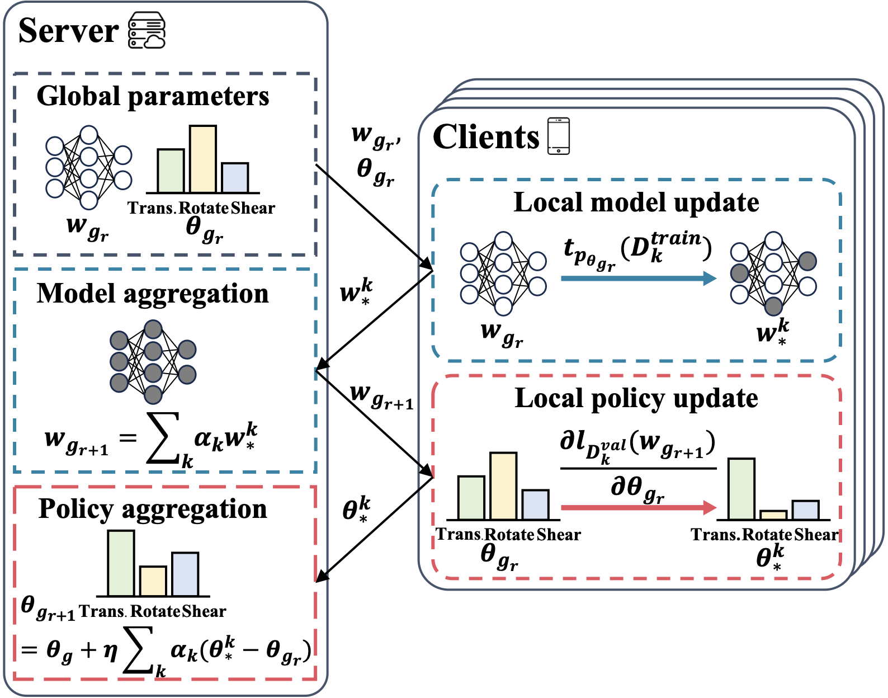
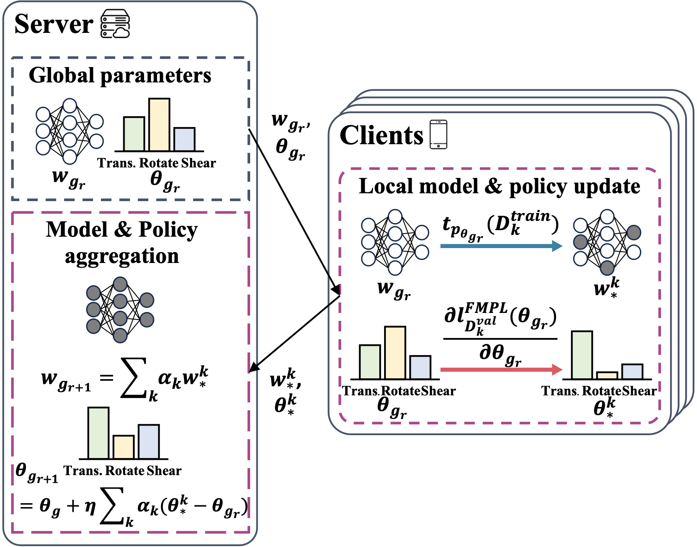

# FedAvP: Augmenting Local Data via Shared Policy in Federated Learning  

This repository contains the official PyTorch implementation for the paper:

- **Minui Hong, Junhyeog Yun, Insu Jeon, and Gunhee Kim**. "**FedAvP: Augmenting Local Data via Shared Policy in Federated Learning**." *NeurIPS 2024*.
  [[paper]](https://openreview.net/forum?id=M1PRU0x1Iz&noteId=hw1nULjwwl)  
> **Note:** This repository will be further updated soon.

|  &nbsp;&nbsp;&nbsp; |  |
| --- | --- |

## Requirements

- Python 3.7.12  
- PyTorch 1.13.1  

## Example Usage (CIFAR-100 / α=0.1)

The dataset will be automatically downloaded when you run the code.

### To train and evaluate FedAvP (FastUpdate):
```bash
python fedavp_FastUpdate.py
```

### To train and evaluate FedAvP: 
```bash
python fedavp.py
```

### Acknowledgments

This code is adapted from the following implementations:

*   [https://github.com/AIoT-MLSys-Lab/DeepAA](https://github.com/AIoT-MLSys-Lab/DeepAA)
*   [https://github.com/ildoonet/pytorch-randaugment/blob/master/RandAugment/augmentations.py](https://github.com/ildoonet/pytorch-randaugment/blob/master/RandAugment/augmentations.py)
*   [https://github.com/insujeon/MetaVD](https://github.com/insujeon/MetaVD)
